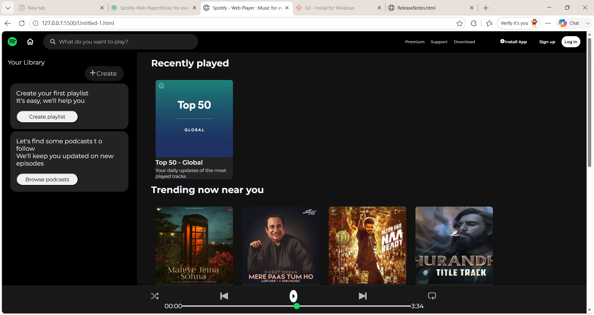
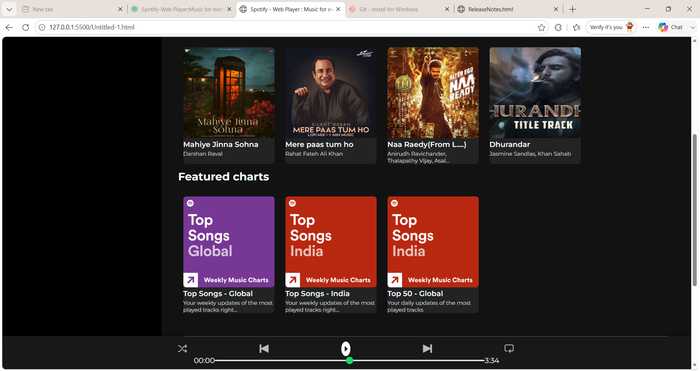

# 🎵 Spotify Clone

A responsive **Spotify Web Player Clone** built using **HTML5** and **CSS3**. This project recreates Spotify's modern user interface, focusing on responsive layouts, clean design, and an engaging user experience.

---

## 🚀 Live Demo

🔗 **Live Website:** *(Add your GitHub Pages link here after deployment)*

🔗 **GitHub Repository:**  
https://github.com/nain-sri22/SpotifyCLone

---

## 📸 Preview


---

## ✨ Features

- 🎵 Spotify-inspired modern UI
- 📱 Responsive layout
- 📌 Sticky navigation bar
- 🎧 Music player section
- 🎨 Beautiful album and playlist cards
- 🖱️ Hover effects and smooth transitions
- 📂 Organized project structure

---

## 🛠️ Tech Stack

- HTML5
- CSS3
- Font Awesome
- Google Fonts

---

## 📁 Project Structure

```
SpotifyCLone/
│── assets/
│── screenshots/
│   └── preview.png
│── index.html
│── style.css
│── README.md
```

---

## 🎯 Learning Outcomes

Through this project, I gained hands-on experience with:

- Semantic HTML
- CSS Flexbox
- Responsive Web Design
- CSS Positioning
- Git & GitHub
- Version Control
- Project Organization

---

## 🚀 Future Improvements

- Add JavaScript functionality
- Play/Pause music controls
- Progress bar functionality
- Volume control
- Playlist navigation
- Dark/Light mode
- Mobile optimization
- Backend integration

---

## 💻 Getting Started

Clone the repository:

```bash
git clone https://github.com/nain-sri22/SpotifyCLone.git
```

Open the project:

```bash
cd SpotifyCLone
```

Run the project by opening:

```
index.html
```

in your browser.

---

## 🤝 Contributing

Contributions, suggestions, and feedback are always welcome!

If you'd like to improve this project:

1. Fork the repository
2. Create a new branch
3. Make your changes
4. Submit a Pull Request

---

## 👩‍💻 Author

**Naincy Srivastava**

- GitHub: https://github.com/nain-sri22
- LinkedIn: *(Add your LinkedIn profile link here)*

---

## ⭐ Support

If you found this project helpful, please consider giving it a **⭐ Star** on GitHub!

It motivates me to build and share more projects.

---

### 📌 Disclaimer

This project is created **for educational and learning purposes only**. Spotify is a trademark of Spotify AB. This project is not affiliated with or endorsed by Spotify.
